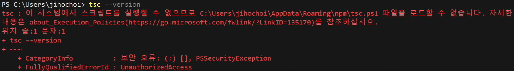
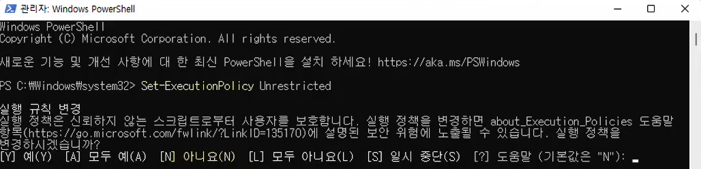
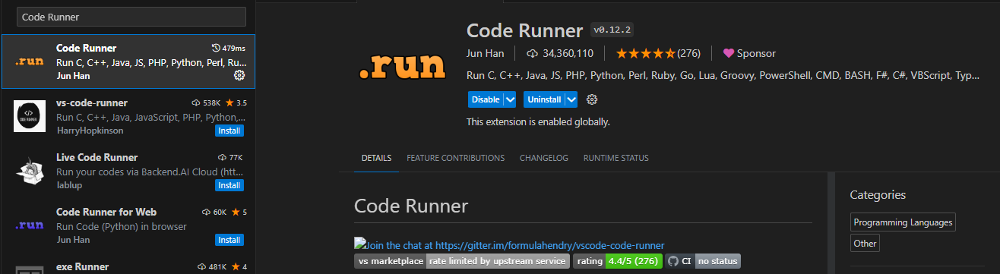

## 실습환경

[뒤로가기](../../README.md)

### Mac

```
# nodejs 버전 확인
node --version

# typescript 패키지 글로벌 설치
npm install typescript --global

# typescript 컴파일러 버전 확인
tsc --version
```

### Windows

```
# nodejs 버전 확인
node --version

# typescript 패키지 글로벌 설치
npm install typescript --global

# typescript 컴파일러 버전 확인
tsc --version
```

**Windows 환경에서 보안 오류가 발생하는 경우**

> PowerShell 관리자 권한으로 실행 → `Set-ExecutionPolicy Unrestricted` 명령어 입력 → "모두 예" 선택 → 터미널 종료 후 다시 `tsc --version` 명령어 확인

**에러메시지**


**Set-ExecutionPolicy Unrestricted** 명령어 입력


### 플러그인 설치

#### Code Runner



```
# ts 파일 실행 단축키
Ctrl + Alt + N # windows
control + option + N # mac
```

### 에러 해결 방법

#### 1. ts-node: command not found
```
npm install -g ts-node
```

#### 2. TypeError: Unknown file extension ".ts"
```
ts --init # tsconfig.json 파일 생성
```